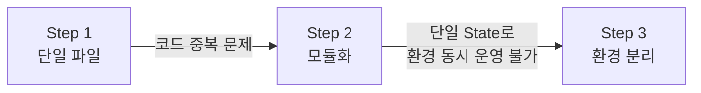
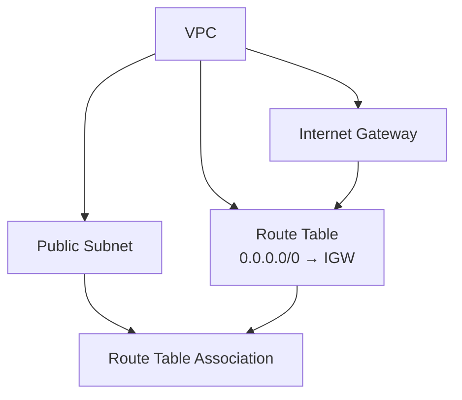
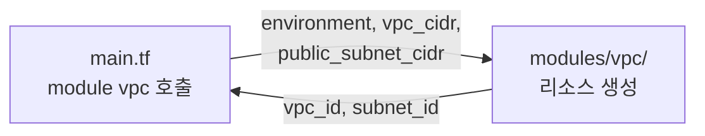
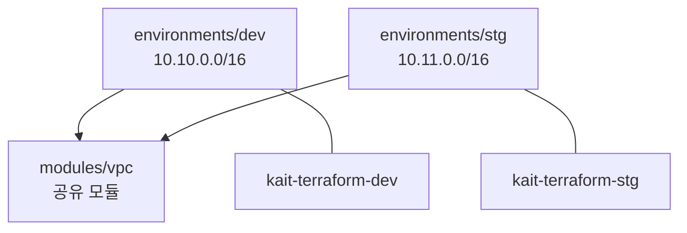
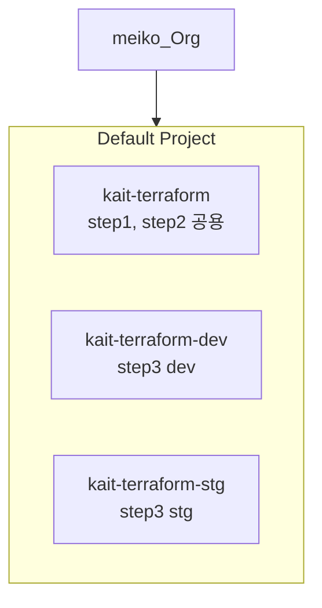

# Terraform으로 배우는 AWS 인프라 관리

같은 인프라, 세 가지 구조 — 단일 파일에서 시작하여 모듈화, 환경 분리까지 **불편함을 체험하고 해결책을 도입**하는 방식으로 진행합니다.



## 사전 준비

| 항목 | 요구사항 |
|---|---|
| AWS 계정 | IAM 사용자, VPC 생성 권한 |
| Terraform CLI | v1.0 이상 |
| Terraform Cloud | Organization 설정 필요 (backend.tf) |

```bash
git clone https://github.com/ByeongHunKim/KAIT-terraform.git
cd terraform-workshop
```

---

## 디렉토리 구조

```
terraform-workshop/
├── step1-single-file/              # 단일 파일 구성
│   ├── main.tf                     # provider + 리소스 5개 + outputs
│   ├── terraform.tf                # 버전 제약
│   └── backend.tf                  # Terraform Cloud 백엔드
├── step2-module/                   # 모듈화
│   ├── main.tf                     # module "vpc" 호출
│   ├── terraform.tf
│   ├── backend.tf
│   └── modules/vpc/                # VPC 모듈
│       ├── main.tf
│       ├── variables.tf
│       └── outputs.tf
├── step3-environments/             # 환경별 분리
│   ├── modules/vpc/                # 공유 모듈
│   │   ├── main.tf
│   │   ├── variables.tf
│   │   └── outputs.tf
│   └── environments/
│       ├── dev/                    # dev 환경
│       │   ├── main.tf            # VPC 모듈 호출
│       │   ├── outputs.tf         # 출력값
│       │   ├── variables.tf
│       │   ├── terraform.tfvars
│       │   ├── terraform.tf
│       │   └── backend.tf
│       └── stg/                    # stg 환경
│           ├── main.tf            # VPC 모듈 호출 + 출력값
│           ├── variables.tf
│           ├── terraform.tfvars
│           ├── terraform.tf
│           └── backend.tf
└── docs/                           # 참고 문서
```

---

## 생성되는 AWS 리소스

### Step 1~3 공통: VPC 기본 구성 (환경당 5개)



---

## Step 1: 단일 파일로 VPC 구성

> 학습 목표: Terraform 기본 문법, 리소스 간 참조, init/plan/apply 워크플로우

모든 리소스가 `main.tf` 한 파일에 하드코딩되어 있는 가장 단순한 형태입니다.

```bash
cd step1-single-file
terraform init
terraform plan
terraform apply
terraform destroy
```

| 리소스 | Name 태그 | 주요 설정 |
|---|---|---|
| VPC | my-vpc | CIDR: 10.10.0.0/16 |
| Subnet | public-subnet | CIDR: 10.10.1.0/24, AZ: ap-northeast-2a |
| Internet Gateway | main-igw | VPC에 연결 |
| Route Table | public-rt | 0.0.0.0/0 → IGW |
| RT Association | - | Subnet ↔ Route Table 연결 |

**한계:** 환경을 추가하려면 파일 전체를 복사하고 값을 일일이 수정해야 합니다.

---

## Step 2: 모듈화로 재사용성 확보

> 학습 목표: module, variable, output 개념과 코드 재사용

리소스를 `modules/vpc/`로 분리하고, 루트 `main.tf`에서 변수를 전달합니다.



```bash
cd step2-module
terraform init
terraform plan
terraform apply
terraform destroy
```

**한계:** dev와 stg를 동시에 운영할 수 없습니다. 하나의 state에 모든 환경이 섞여있기 때문입니다.

---

## Step 3: 환경별 분리

> 학습 목표: 환경별 독립 state, 실무 디렉토리 구조, default_tags 활용

공유 모듈을 환경별 디렉토리에서 각각 호출하며, state가 완전히 분리됩니다.



```bash
# dev 환경
cd step3-environments/environments/dev
terraform init && terraform plan && terraform apply

# stg 환경
cd step3-environments/environments/stg
terraform init && terraform plan && terraform apply
```

### 환경별 CIDR 설계

| 환경 | VPC CIDR | Public Subnet | Workspace |
|---|---|---|---|
| dev | 10.10.0.0/16 | 10.10.1.0/24 | kait-terraform-dev |
| stg | 10.11.0.0/16 | 10.11.1.0/24 | kait-terraform-stg |
| prd | 10.12.0.0/16 | 10.12.1.0/24 | (환경 추가 시) |

---

## Terraform Cloud Workspace 구성



| Step | Workspace | Working Directory |
|---|---|---|
| step1 | kait-terraform | `step1-single-file` |
| step2 | kait-terraform | `step2-module` |
| step3/dev | kait-terraform-dev | `step3-environments/environments/dev` |
| step3/stg | kait-terraform-stg | `step3-environments/environments/stg` |

> step1/2는 같은 workspace를 사용하므로 **반드시 destroy 후 다음 step으로** 진행합니다.

---

## 단계별 비교

| | Step 1 | Step 2 | Step 3 |
|---|---|---|---|
| 코드 구조 | 단일 파일 | 루트 + 모듈 | 환경별 디렉토리 + 공유 모듈 |
| 변수 사용 | 하드코딩 | variable로 전달 | variable + tfvars |
| State | 1개 | 1개 | 환경별 독립 |
| 환경 동시 운영 | 불가 | 불가 | 가능 |
| 환경 추가 | 파일 복사 + 전체 수정 | main.tf 값 수정 | 디렉토리 복사 + tfvars 수정 |

---

## 리소스 정리

```bash
# step3
cd step3-environments/environments/stg && terraform destroy -auto-approve
cd step3-environments/environments/dev && terraform destroy -auto-approve

# step2 (step3만 실습한 경우 생략)
cd step2-module && terraform destroy -auto-approve

# step1 (step2 이상 진행한 경우 생략)
cd step1-single-file && terraform destroy -auto-approve
```
