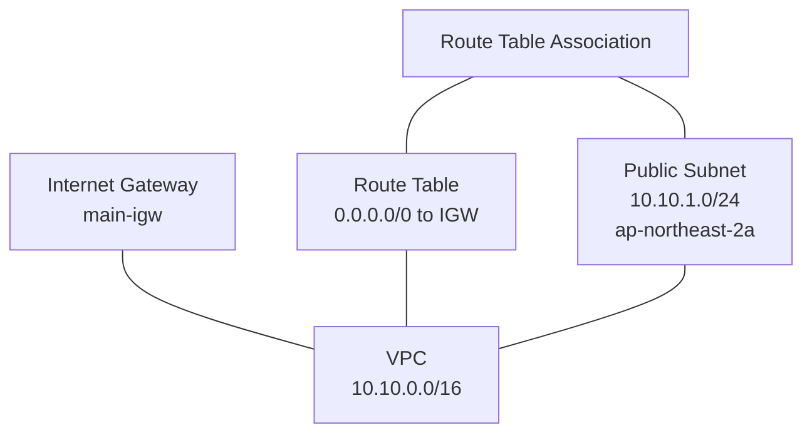
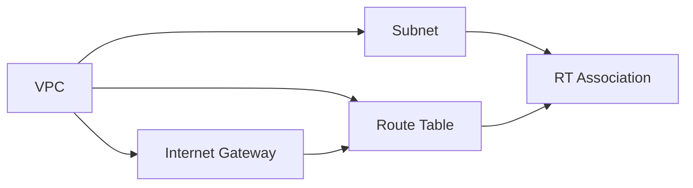

# Step 1: 단일 파일로 VPC 구성

## 학습 목표

- Terraform 기본 문법(`resource`, `output`, `provider`) 이해
- `terraform init → plan → apply → destroy` 워크플로우 체험
- AWS VPC 네트워크의 기본 구성요소 파악

## 파일 구조

```
step1-single-file/
├── main.tf          # 모든 리소스 + provider + output 정의
├── terraform.tf     # Terraform 버전 & AWS provider 버전 제약
├── backend.tf       # Terraform Cloud 백엔드 설정
└── README.md
```

> 모든 리소스가 `main.tf` 한 파일에 들어있는 가장 단순한 형태입니다.

## 생성되는 리소스 (5개)



### aws_vpc.main

| 항목 | 값 |
|---|---|
| CIDR | `10.10.0.0/16` (65,536개 IP) |
| enable_dns_hostnames | `true` — EC2에 퍼블릭 DNS 호스트명 부여 |
| enable_dns_support | `true` — VPC 내부 DNS 해석 활성화 |
| Name 태그 | `my-vpc` |

### aws_subnet.public

| 항목 | 값 |
|---|---|
| CIDR | `10.10.1.0/24` (실사용 251개 IP) |
| AZ | `ap-northeast-2a` |
| map_public_ip_on_launch | `true` — EC2 생성 시 퍼블릭 IP 자동 할당 |
| Name 태그 | `public-subnet` |

### aws_internet_gateway.main

| 항목 | 값 |
|---|---|
| 역할 | VPC와 인터넷 간 트래픽 연결 |
| Name 태그 | `main-igw` |

### aws_route_table.public

| 항목 | 값 |
|---|---|
| route | `0.0.0.0/0` → IGW (외부 트래픽을 인터넷으로 전달) |
| Name 태그 | `public-rt` |

### aws_route_table_association.public

| 항목 | 값 |
|---|---|
| 역할 | Public Subnet과 Route Table을 연결 |

> 이 연결이 없으면 서브넷은 VPC의 Main Route Table을 사용하게 되어 인터넷 접근이 불가합니다.

## 리소스 의존 관계 (생성 순서)



화살표 방향: A → B는 A가 먼저 생성되어야 B 생성 가능

Terraform이 이 의존 관계를 자동 파악하여 다음 순서로 실행합니다:

1. VPC 생성
2. Subnet, Internet Gateway 병렬 생성
3. Route Table 생성 (IGW ID 필요)
4. Route Table Association 생성 (Subnet ID + RT ID 필요)

## 실습 순서

### 사전 준비

- `backend.tf`의 `organization`을 본인의 Terraform Cloud 조직명으로 변경

### 실행

```bash
cd step1-single-file

# 1단계: 초기화 (provider 다운로드 + backend 연결)
terraform init

# 2단계: 실행 계획 확인 (실제 변경 없음)
terraform plan

# 3단계: 리소스 생성
terraform apply

# 4단계: 생성된 리소스 확인
terraform show

# 5단계: 실습 종료 후 리소스 삭제
terraform destroy
```

### 각 명령어 역할

| 명령어 | 설명 |
|---|---|
| `terraform init` | provider 플러그인 다운로드, backend 초기화 |
| `terraform plan` | 현재 상태와 코드를 비교하여 변경 계획 출력 |
| `terraform apply` | plan 결과를 실제 AWS에 반영 |
| `terraform show` | 현재 state에 저장된 리소스 상태 출력 |
| `terraform destroy` | 생성된 모든 리소스 삭제 |

## 이 단계의 한계점

- 환경(dev, stg, prd)을 추가하려면 **파일 전체를 복사**해야 함
- CIDR, 이름 등을 **일일이 수동 수정**해야 함
- 변수(`variable`)나 모듈(`module`)이 없어 **재사용 불가**

이 한계는 [Step 2 (모듈화)](../step2-module/)에서 해결합니다.
