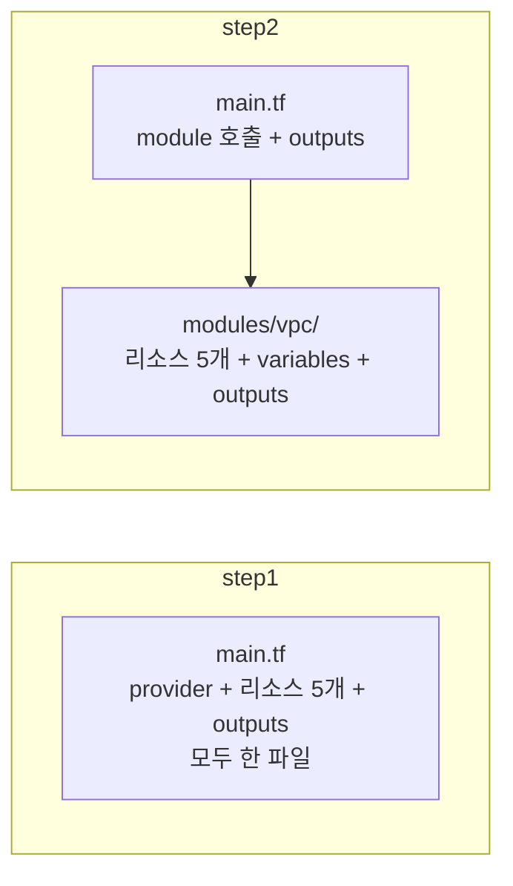
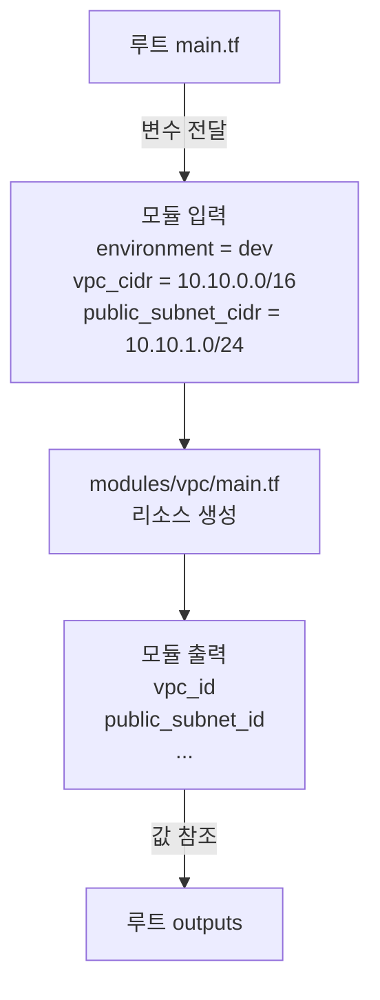
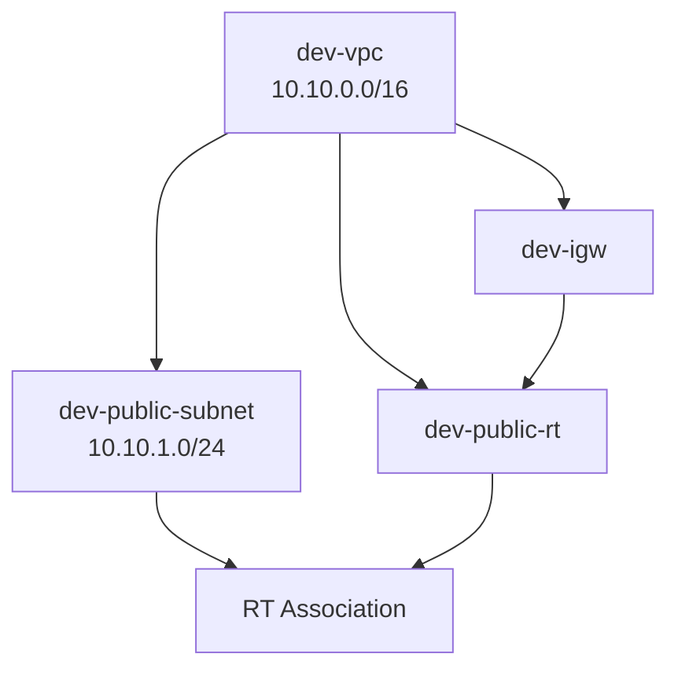

# Step 2: 모듈화로 재사용성 확보

## 학습 목표

- `module` 블록을 사용하여 리소스를 캡슐화하는 방법 이해
- `variable`과 `output`으로 모듈 인터페이스 설계하는 패턴 체험
- step1 대비 코드 재사용성이 어떻게 개선되는지 확인

## 파일 구조

```
step2-module/
├── main.tf              # module "vpc" 호출 + outputs
├── terraform.tf         # Terraform 버전 & provider 설정
├── backend.tf           # Terraform Cloud 백엔드 설정
└── modules/
    └── vpc/
        ├── main.tf      # 리소스 정의 (VPC, Subnet, IGW, RT, RTA)
        ├── variables.tf # 모듈 입력 변수
        └── outputs.tf   # 모듈 출력값
```

## step1과의 구조 비교



step1에서는 모든 것이 하나의 main.tf에 있었지만, step2에서는 **루트 모듈**과 **VPC 모듈**로 분리됩니다.

## 모듈 호출 흐름



## 모듈 입력 변수

| 변수 | 타입 | 기본값 | 설명 |
|---|---|---|---|
| `environment` | string | - | 환경 이름 (리소스 네이밍에 사용) |
| `vpc_cidr` | string | - | VPC CIDR 블록 |
| `public_subnet_cidr` | string | - | 퍼블릭 서브넷 CIDR |
| `availability_zone` | string | ap-northeast-2a | 가용 영역 |

## 모듈 출력값

| 출력 | 설명 |
|---|---|
| `vpc_id` | 생성된 VPC ID |
| `vpc_cidr_block` | VPC CIDR 블록 |
| `public_subnet_id` | 퍼블릭 서브넷 ID |
| `internet_gateway_id` | Internet Gateway ID |
| `public_route_table_id` | 퍼블릭 라우트 테이블 ID |

## 생성되는 리소스 (5개)



리소스는 step1과 동일하지만, 네이밍이 `${var.environment}-리소스타입` 패턴으로 변경됩니다.

## 실습 순서

### 사전 준비

- step1의 리소스가 `destroy` 되어있는지 확인
- `backend.tf`의 organization이 `meiko_Org`로 설정되어있는지 확인

### 실행

```bash
cd step2-module

# 초기화
terraform init

# 실행 계획 확인
terraform plan

# 리소스 생성
terraform apply

# 생성된 리소스 확인
terraform show

# 실습 종료 후 리소스 삭제
terraform destroy
```

### 실습 과제: 환경 변경해보기

`main.tf`에서 모듈 호출 값을 변경하여 stg 환경을 만들어보세요:

```hcl
module "vpc" {
  source = "./modules/vpc"

  environment        = "stg"           # dev -> stg
  vpc_cidr           = "10.11.0.0/16"   # 10.10 -> 10.11
  public_subnet_cidr = "10.11.1.0/24"   # 10.10 -> 10.11
}
```

> 값만 바꾸면 다른 환경이 만들어지는 것이 모듈화의 장점입니다.

## step1 대비 개선점

| 항목 | step1 | step2 |
|---|---|---|
| 리소스 정의 | main.tf에 직접 작성 | 모듈로 캡슐화 |
| 환경 변경 | 리소스마다 값 수정 | 모듈 호출 인자 3개만 변경 |
| 네이밍 | 하드코딩 | 변수 기반 자동 생성 |
| 코드 재사용 | 불가 | 모듈 재사용 가능 |

## 이 단계의 한계점

- dev와 stg를 **동시에** 띄울 수 없음 (같은 state를 공유하므로)
- 환경을 바꾸려면 `main.tf`를 직접 수정해야 함
- 한 환경 destroy가 다른 환경에 영향을 줄 수 있음

이 한계는 [Step 3 (멀티 환경)](../step3-environments/)에서 환경별 디렉토리 + state 분리로 해결합니다.
