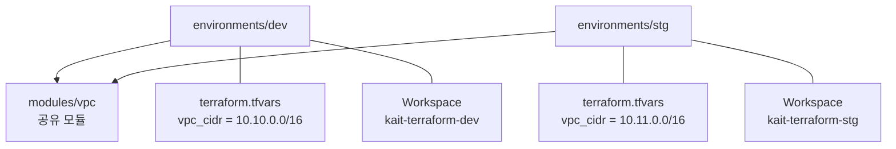
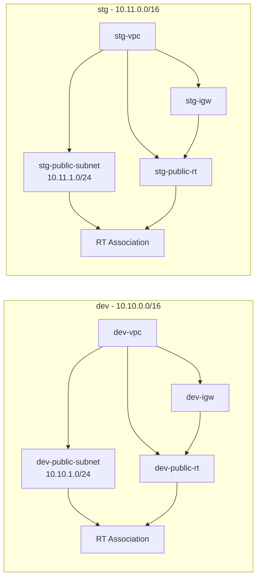
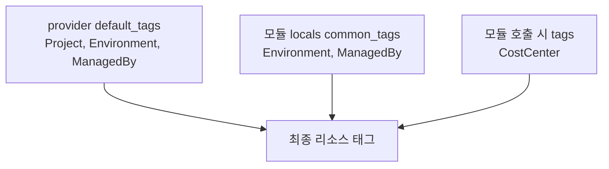

# Step 3: 멀티 환경 (단일 Account, 환경별 State 분리)

## 학습 목표

- 하나의 AWS 계정에서 dev/stg 환경을 동시에 운영하는 패턴 이해
- 환경별 state 분리의 필요성 체험
- 공유 모듈 + 환경별 tfvars 조합으로 코드 중복 제거

## 디렉토리 구조

```
step3-environments/
├── modules/
│   └── vpc/
│       ├── main.tf            # 리소스 정의 (VPC, Subnet, IGW, RT, RTA)
│       ├── variables.tf       # 모듈 입력 변수
│       └── outputs.tf         # 모듈 출력값
└── environments/
    ├── dev/
    │   ├── main.tf            # module "vpc" 호출 + outputs
    │   ├── variables.tf       # 환경 변수 선언
    │   ├── terraform.tfvars   # dev 환경 값 (CIDR, AZ 등)
    │   ├── terraform.tf       # provider + default_tags
    │   └── backend.tf         # Terraform Cloud workspace
    └── stg/
        ├── main.tf
        ├── variables.tf
        ├── terraform.tfvars
        ├── terraform.tf
        └── backend.tf
```

## 핵심 구조: 모듈 공유 + 환경 분리



## 환경별 설정 비교

| 항목 | dev | stg |
|---|---|---|
| Workspace | `kait-terraform-dev` | `kait-terraform-stg` |
| VPC CIDR | `10.10.0.0/16` | `10.11.0.0/16` |
| Subnet CIDR | `10.10.1.0/24` | `10.11.1.0/24` |
| AZ | `ap-northeast-2a` | `ap-northeast-2a` |
| CostCenter 태그 | `development` | `staging` |
| default_tags Environment | `dev` | `stg` |

## 생성되는 리소스 (환경당 5개, 총 10개)



각 환경의 리소스 네이밍은 `${var.environment}-리소스타입` 패턴을 따릅니다.

## 태그 전략

태그는 3개 레이어에서 병합됩니다:



dev 환경 VPC에 적용되는 최종 태그 예시:

| Key | Value | 출처 |
|---|---|---|
| Project | terraform-workshop | provider default_tags |
| Environment | dev | provider default_tags + module locals |
| ManagedBy | Terraform | provider default_tags + module locals |
| CostCenter | development | module 호출 시 tags |
| Name | dev-vpc | 리소스별 개별 지정 |

## 모듈 입력 변수

| 변수 | 타입 | 기본값 | 설명 |
|---|---|---|---|
| `environment` | string | - | 환경 이름 (dev, stg, prd) |
| `vpc_cidr` | string | - | VPC CIDR 블록 |
| `public_subnet_cidr` | string | - | 퍼블릭 서브넷 CIDR |
| `availability_zone` | string | ap-northeast-2a | 가용 영역 |
| `tags` | map(string) | {} | 추가 태그 |

## 실습 순서

### 사전 준비

- step1, step2의 리소스가 모두 `destroy` 되어있는지 확인

### dev 환경 배포

```bash
cd step3-environments/environments/dev

terraform init
terraform plan
terraform apply
```

### stg 환경 배포

```bash
cd step3-environments/environments/stg

terraform init
terraform plan
terraform apply
```

### 동시 존재 확인

두 환경 모두 apply 후, AWS 콘솔에서 VPC 목록을 확인하면 같은 account에 두 VPC가 공존합니다:

| VPC | CIDR |
|---|---|
| dev-vpc | 10.10.0.0/16 |
| stg-vpc | 10.11.0.0/16 |

### 리소스 정리

```bash
# stg 먼저 삭제
cd step3-environments/environments/stg
terraform destroy

# dev 삭제
cd step3-environments/environments/dev
terraform destroy
```

## step2 대비 개선점

| 항목 | step2 | step3 |
|---|---|---|
| State | 전체 환경이 1개 state | 환경별 독립 state |
| 환경 추가 | 코드 수정 필요 | 디렉토리 복사 + tfvars 수정 |
| 동시 배포 | 불가 (state 충돌) | 가능 (state 분리) |
| 환경별 destroy | 전체에 영향 | 해당 환경만 영향 |

## 새 환경 추가 방법 (예: prd)

```bash
# dev 디렉토리 복사
cp -r environments/dev environments/prd
```

수정할 파일 3개:

- `backend.tf` — workspace 이름을 `kait-terraform-prd`로 변경
- `terraform.tfvars` — environment, CIDR 값 변경
- `terraform.tf` — default_tags의 Environment를 `prd`로 변경

CIDR 규칙: `10.{환경번호}.0.0/16` (dev=10, stg=11, prd=12)
